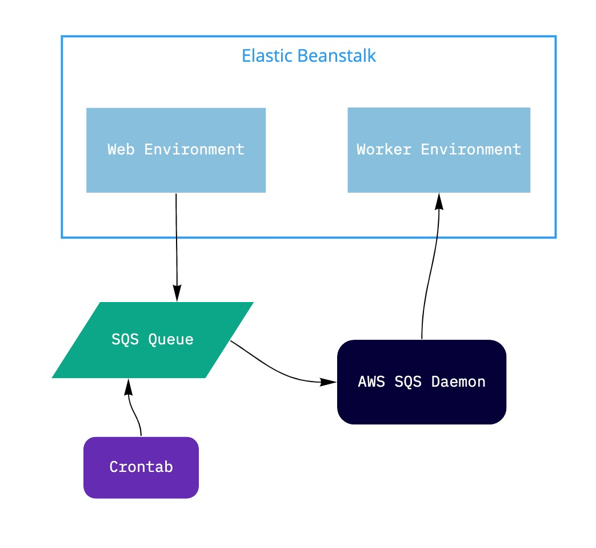

[](https://github.com/DataGreed/django-eb-sqs-worker/actions?query=workflow%3ATests)
[](https://badge.fury.io/py/django-eb-sqs-worker)
[](https://opensource.org/licenses/MIT)

# django-eb-sqs-worker

Django Background Tasks for Amazon Elastic Beanstalk.

Created by Alexey "DataGreed" Strelkov.

## Overview

_django-eb-sqs-worker_ lets you handle background jobs on 
[Elastic Beanstalk Worker Environment](https://docs.aws.amazon.com/elasticbeanstalk/latest/dg/using-features-managing-env-tiers.html) 
sent via SQS and provides methods to send tasks to worker.

You can use the same Django codebase for both your Web Tier and Worker Tier environments and send tasks 
from Web environment to Worker environment. Amazon fully manages autoscaling for you. 

Tasks are sent via [Amazon Simple Queue Service](https://docs.aws.amazon.com/AWSSimpleQueueService/latest/SQSDeveloperGuide/welcome.html) 
and are delivered to your worker with [Elastic Beanstalk's SQS daemon](https://docs.aws.amazon.com/elasticbeanstalk/latest/dg/using-features-managing-env-tiers.html#worker-daemon). 
Periodic tasks are also supported. 

Here's the diagram of how tasks move through the system, tasks movement is represented by arrows:



## Installation

Install using pip (only python3.x+ is supported):

```
pip install django-eb-sqs-worker
```

Add `eb_sqs_worker` to `settings.INSTALLED_APPS`:
```python
INSTALLED_APPS = [
    # ...
    "eb_sqs_worker",
]
```

Add `localhost` to `settings.ALLOWED_HOSTS` so SQS Daemon can post tasks from 
the queue to your worker:
```python
ALLOWED_HOSTS = [
    # ...
    "localhost",
]
```


Update your `settings.py` for both Worker and Web EB environments:
```python
# region where your elastic beanstalk environments are deployed, e.g. "us-west-1"
AWS_EB_DEFAULT_REGION = "your default region"    
# your aws access key id
AWS_ACCESS_KEY_ID = "insert your key id here"
# your aws access key 
AWS_SECRET_ACCESS_KEY = "insert your key here"
# queue name to use - queues that don't exist will be created automatically
AWS_EB_DEFAULT_QUEUE_NAME = "any_queue_name_to_use"
```

In the settings file for your **Web** tier environment add the following setting 
(this is important due to possible security problems if you don't set this):
```python
# never set to True on Web environment. Use True only on Worker env and local development env
AWS_EB_HANDLE_SQS_TASKS=False   
```

In the setting files used by your **Worker** environments add the following setting:
```python
# never set to True on Web environment. Use True only on Worker env and local development env
AWS_EB_HANDLE_SQS_TASKS=True
```

Add eb-sqs-worker urls to your project's main `urls.py` module:
```python
# urls.py

urlpatterns = [
    # your url patterns
    # ... 
]

from eb_sqs_worker.urls import urlpatterns as eb_sqs_urlpatterns
urlpatterns += eb_sqs_urlpatterns
```

Navigate to your Worker environment in Elastic Beanstalk Web console, then go to _Configuration > Worker_
and set HTTP path to `/sqs/`.

You should also select the queue to use here corresponding to your `AWS_EB_DEFAULT_QUEUE_NAME` 
or, if you prefer to use the autogenerated one, you can copy its name and set as your `AWS_EB_DEFAULT_QUEUE_NAME`.
If you don't see your `AWS_EB_DEFAULT_QUEUE_NAME` here, try sending first task to it (see *"Queueing tasks"* section)
and it will be automatically created for you (you may need to reload the page for it to appear here). 

Apply changes. 


## Usage

### Simple way

#### Defining Background Tasks

To define a job create a function decorated by `task` decorator:

```python
from eb_sqs_worker.decorators import task
@task
def some_task(**kwargs):
    # define your task here
    print(f"The decorated test task is being run with kwargs {kwargs} and will echo them back")

    return kwargs
``` 

Make sure the module with your tasks is imported so they will register correctly. 

The best practice is to do it as soon as django loads, e.g. in your app's `models.py` or in corresponding `AppConfig`. 

#### Queueing tasks

If the task was defined using `@task` decorator, you can send it to background queue like this:

```python
# sends the task to SQS queue where it will be automatically picked up and executed by worker
some_task(foo="bar")    
```

You can set `settings.AWS_EB_RUN_TASKS_LOCALLY` to `True` in development – this will force all tasks to execute
locally in sync mode without sending them to the queue. This is useful for testing.

If you need to execute the function synchronously just one time somewhere in your code without changing this setting, 
you can do it like this: 

```python
# runs the task function synchronously without sending it to the queue and returns result
result = some_task.execute(foo="bar")   
```

**Note:** don't supply positional arguments to the task, always use keyword arguments.

#### Periodic tasks

Periodic tasks are defined the same way as regular task, but it's better to supply a custom name for them:

```python
from eb_sqs_worker.decorators import task
@task(task_name="some_periodic_task")
def periodic_task():
    # define your periodic task here
    print(f"Periodic test task is being run ")

    return True
``` 

Add `cron.yaml` to the root of the project:

```yaml
version: 1
cron:
 - name: "some_periodic_task"
   url: "/sqs/"
   schedule: "0 23 * * *"
```

Deploy your project to elastic beanstalk and your task will run every day at 23:00. 

Refer to [the documentation](https://docs.aws.amazon.com/elasticbeanstalk/latest/dg/using-features-managing-env-tiers.html#worker-periodictasks) for more info on periodic tasks.

**Note**: periodic tasks don't support arguments passing


`#TODO describe` (add link to https://docs.aws.amazon.com/elasticbeanstalk/latest/dg/using-features-managing-env-tiers.html#worker-periodictasks), explain configuration


### Advanced way

#### Defining Background Tasks

`#TODO describe`
#### Queueing tasks
`#TODO describe`


#### Periodic tasks

`#TODO describe`

### Interface reference

## @task decorator

`#TODO: add info on arguments`

## send_task

`#TODO: add info on arguments`

## Settings

### AWS_EB_HANDLE_SQS_TASKS
If set to `True`, tasks will be accepted and handled on this instance. If set to `False`, the URL for handling 
tasks will return 404. Defaults to `False`.

**Important:** set this to `True` _only_ on your [Worker environment](https://docs.aws.amazon.com/elasticbeanstalk/latest/dg/using-features-managing-env-tiers.html)

### AWS_EB_ENABLED_TASKS
Dictionary of enabled tasks. Routes task names to actual task methods.

If you register your tasks using the `task` decorator, you don't need to worry about this setting at all,
it will be set automatically by the decorator. 

E.g.:

```python
AWS_EB_ENABLED_TASKS = {
    # name used in serialization   # path to actual method that does the job
    "accounts_confirmation_email": "accounts.tasks.send_confirmation_email",
    "analytics_track_event": "analytics.tasks.track_event"
}
``` 

### AWS_EB_DEFAULT_REGION

Default Elastic Beanstalk Region. Use the one that your app id deployed in. 

### AWS_EB_DEFAULT_QUEUE_NAME

Name of the queue used by default. If the queue with specified name does not exist, it will be created
automatically when the first task is queued.

### AWS_ACCESS_KEY_ID

Amazon Access Key Id, refer to [the docs](https://docs.aws.amazon.com/general/latest/gr/aws-sec-cred-types.html#access-keys-and-secret-access-keys)

### AWS_SECRET_ACCESS_KEY

Amazon Secret Access Key, refer to [the docs](https://docs.aws.amazon.com/general/latest/gr/aws-sec-cred-types.html#access-keys-and-secret-access-keys)

### AWS_EB_RUN_TASKS_LOCALLY

If set to true, all tasks will be run locally and synchronnously instead of being sent to SQS Queue. Defaults to `False`

### AWS_EB_ALERT_WHEN_EXECUTES_LONGER_THAN_SECONDS

Set this to the maximum number of seconds the job is supposed to run. If the job finishes requires more time to finish
ADMINS will be notified by email.

## Security

Always set `AWS_EB_HANDLE_SQS_TASKS=False` on Web Tier Environment so the tasks could not be spoofed! 
Web Tier environments are typically used for hosting publici websites and can be accessed by anoyone on the Internet, 
meaning that anyone can send any jobs to your site if you leave this option on on Web environment.

Worker environments can only be accessed internally, e.g. via SQS Daemon that POSTs, so `AWS_EB_HANDLE_SQS_TASKS=True` 
should be set only on worker environments.

Use [Elastic Beanstalk Environment properties](https://docs.aws.amazon.com/elasticbeanstalk/latest/dg/environments-cfg-softwaresettings.html#environments-cfg-softwaresettings-console) 
to supply different setting files for Web and Worker environments. See also: [docs on designating the Django settings](https://docs.djangoproject.com/en/3.0/topics/settings/#designating-the-settings)

## Tips

`#TODO`

### Accessing Web Tier Database from Worker

You will probably want your worker environment to have access to the same database as your web tier environment.

Assuming you have a web tier environment and a worker environment with the same Django apps deployed 
(if you don't have a worker environment, yet, you can create it using `eb create -t worker <environment name>`)
and the web tier environment has an 
[attached database](https://docs.aws.amazon.com/elasticbeanstalk/latest/dg/using-features.managing.db.html) 
set up via Elastic Beanstalk with database connection settings populated from environmantal variables, 
do the following:

1. Open Elastic Beanstalk Web Console 
2. Navigate to your Web Tier environment > Configuration > Database
3. Copy database connection settings. Note that the database password will not be shown here. If you don't remember it, 
you can connect to the Web environment using `eb ssh` and getting it using `cat /opt/python/current/env`
4. Navigate to your Worker environment >  Configuration > Software > Edit
5. Add environmental variables for DB connection that you've copied (`RDS_PORT`,`RDS_PASSWORD`,`RDS_USERNAME`, 
`RDS_DB_NAME`, `RDS_HOSTNAME`) and hit "Apply"
6. Navigate to your Worker environment >  Configuration > Instances > Edit
7. Add security group corresponding to your Web Tier environment and hit "Apply", confirm changes.
8. Re-deploy the application using `eb deploy` to make sure that everything works as expected.

### Delay abstraction

`#TODO`

### Using different cron files for different environments

`#TODO`

## Testing

### Synchronous mode

When developing on local machine it might be a good idea to set `AWS_EB_RUN_TASKS_LOCALLY=True`, so all the tasks 
that should normally be sent to queue will be executed locally on the same machine in sync mode. This lets you test
your actual task methods in integration tests.

### Testing django-eb-sqs-worker itself

Clone the repository.

```
git clone https://github.com/DataGreed/django-eb-sqs-worker.git
```

Install requirements (use python virtual environment)
```
cd django-eb-sqs-worker
pip install -r requirements.txt
```

Run tests
```
sh test.sh
```


## Contributing

If you would like to contribute, please make a Pull Request with the description of changes and add tests to cover
these changes.

Feel free to open issues if you have any problems or questions with this package.


# TODOs

- take advantage of the new [environment link feature](https://docs.aws.amazon.com/elasticbeanstalk/latest/dg/environment-cfg-links.html)
- add pickle serialization
- finish readme
- parse GET-parameters for periodic tasks? 

---
Search tags 

Django Elastic Beanstalk Worker Web Tier Asynchronous celery async django-q Jobs Background Tasks SQS 
